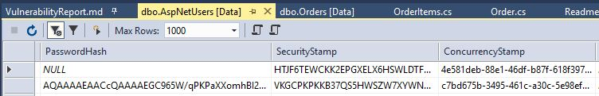

# Vulnerability Report

## Vulnerability 1
### SQL Injection

We are aware of the vulnerability of SQL Injection. So we will explain in our own words what SQL Injection is. The act of SQL Injection is to modify an input parameter that forces a SQL statement to maliciously enact an unintended behavior. Or more colloquially, code that can be used in the front-end to manipulate the backend.
By exploiting this, a malicious hacker could gain access to our database tables and take user information such as their name, address, credit card numbers, etc. They could also create new tables or add in fake data. Or delete everything.

### Repair
We took more of a preventative measure. The way we approached this is by using EntityFramework, which is an ORM or Object Relational Mapper. Or LINQ (Language Integrated Queries). While it is not impossible to prevent SQL injection attacks with .NET Core, using EntityFramework and LINQ are recommended.

## Resources
- http://www.sqlsolutionsgroup.com/combating-sql-injection/
- http://www.applicure.com/solutions/prevent-sql-injection-attacks

## Vulnerability 2
### Weak Account Management
We are aware of the vulnerability called Weak Account Management and took preventative measures. This will be explained below under Repair. Weak Account Management involves password hashing, which is "the act of converting passwords into unreadable strings of characters that are designed to be impossible to convert back, known as hashes."
If a hacker were to figure out the password to our site, they could log in and create fake data. Or delete our site completely. Or take all of our users' information.

### Repair
We hash user passwords through .NET Core's Identity, which uses the PBKDF2 hashing algorithm along with adding salt too. This algorithm is the strongest and fastest protection known so far.

Here is an image of a salting in our database:

## Resources
- https://www.wired.com/2016/06/hacker-lexicon-password-hashing/
- https://medium.com/@kasunpdh/how-to-store-passwords-securely-with-pbkdf2-204487f14e84

## Vulnerability Three
### Cross Site Scripting (XSS)
We have vulnerabilities in our script tags. Technically if organizations like Bootstrap, or Jquery, could inject malicious content into their files that could extract personal data from my Ecommerce website's Users. Which is not good, like passwords, cookies, and other goodies.

Anytime we have a 'script' tag in our html, it is an open call for that org to inject unwanted scripts into our website. Because it is just a simple line a code to direct us to their file system, we would have no idea they changed/added anything. 

### Repair
It wouldn't be code that would fix this, but to download their SDK and look into their files to check ourselves that nothing malicious was in it, then use our local files instead of a script tag. This would insure we know exactly what comes with the SDK and that our users are safe. An issue not so much, more of a good practice to only add script tags from reliable sources.

## Vulnerability Four
### Cross Origin Resource Sharing (CORS)

We do not have CORS vulnerability problems. We have access restrictions all over our site to only allow. These are only activated because of a UseCors(); line in our startup Config. This would be identified or become vulnerable if a user could access a admin page. By manually changing the url to something like www.Site.com/Admin/Dashboard and having access. Ours however does not because the site is properly laid out with Role claims and user Access restriction.

### Repair
This isn't an issue in .NET Core because of the easy restrictions we can added to our controllers to prevent users to access unwanted parts of our site.
